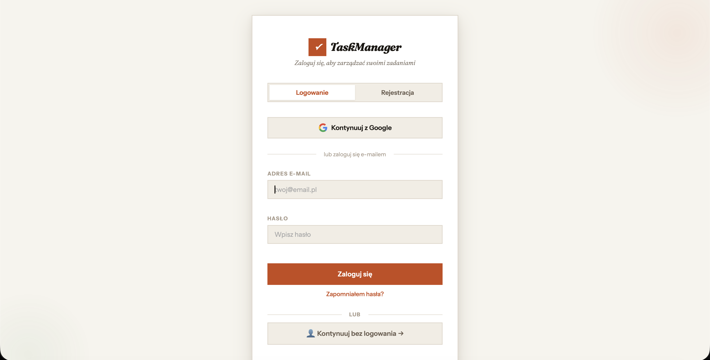
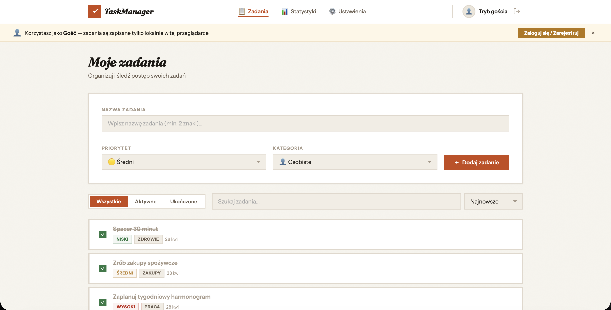
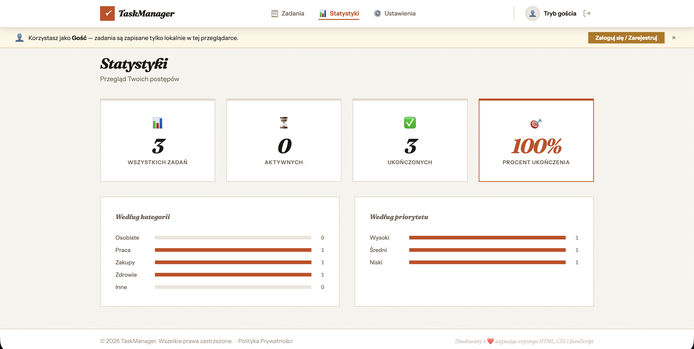
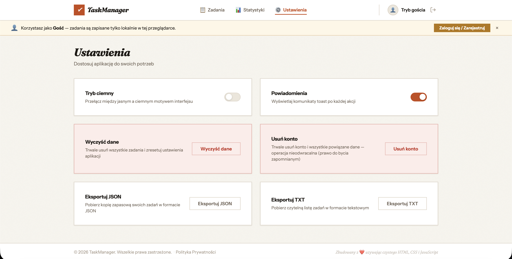

<p align="center">
  
</p>

<h1 align="center">TaskManager</h1>

<p align="center">
  Prosty task manager, który nie stoi na drodze — dodawaj, filtruj i śledź zadania w czasie rzeczywistym.
  <br />
  <a href="README.md">🇬🇧 Read in English</a> · 🇵🇱 <strong>Polski</strong>
  <br />
  <a href="https://w84kubus.github.io/TaskManager/"><strong>🌐 w84kubus.github.io/TaskManager</strong></a>
</p>

<p align="center">
  
  
  
  
  
  
</p>

---

## O aplikacji

**TaskManager** to aplikacja webowa do zarządzania zadaniami zrobiona tak, żeby nie przeszkadzać — bez frameworka, bez procesu budowania, po prostu szybka lista, której można zaufać. Odpowiada na cztery pytania natychmiast po otwarciu:

1. 📋 **Co muszę dziś zrobić?**
2. 🎯 **Co jest najpilniejsze w tej chwili?**
3. ✅ **Co już ukończyłem?**
4. 📊 **Jak wygląda mój postęp?**

Wszystko wpisywane ręcznie i synchronizowane w czasie rzeczywistym — bez importu kalendarzy, bez automatycznego planowania. Zadanie, które świadomie wpisałeś, to zadanie, które faktycznie masz szansę zrobić.

## Screenshots

| Logowanie | Lista zadań |
|-----------|-------------|
|  |  |

| Statystyki | Ustawienia |
|------------|------------|
|  |  |

## Funkcje

### Logowanie i konto
- **Google** - logowanie przez popup Google OAuth
- **E-mail / hasło** - rejestracja z walidacją, zapis w Firebase Auth
- **Weryfikacja e-mail** - link weryfikacyjny przy rejestracji; bez potwierdzenia brak dostępu
- **Reset hasła** - „Zapomniałem hasła?" wysyła link resetujący na e-mail
- **Tryb gościa** - dostęp lokalny bez zakładania konta, dane zostają w przeglądarce

### Synchronizacja w chmurze
- Synchronizacja zadań w **czasie rzeczywistym** (`onSnapshot`)
- Każde zadanie to osobny dokument Firestore - brak konfliktów przy równoczesnym zapisie
- Dark mode i powiadomienia synchronizowane między urządzeniami
- Dane izolowane per konto (`request.auth.uid == userId`)

### Zadania
- Dodawanie, edycja, usuwanie, oznaczanie jako ukończone - aktywne zawsze nad ukończonymi
- Filtrowanie (wszystkie / aktywne / ukończone) + wyszukiwanie live
- Sortowanie po dacie, priorytecie lub alfabetycznie
- Modal potwierdzenia zamiast natywnego `confirm()`

### Statystyki
- Karty podsumowujące - wszystkich, aktywnych, ukończonych, procent ukończenia
- Wykresy słupkowe według kategorii i priorytetu

### Dwujęzyczny interfejs (PL/EN)
- Przełącznik języka w headerze i na ekranie logowania
- Cały interfejs przetłumaczony, łącznie z Polityką Prywatności
- Wybór języka zapamiętywany w `localStorage`

### Eksport danych
- **JSON** - pełna kopia zapasowa z metadanymi
- **TXT** - czytelna lista zadań, w wybranym języku

### Zgodność z RODO
- Pełna Polityka Prywatności w stopce i przy rejestracji (9 sekcji)
- Obowiązkowy checkbox zgody przy rejestracji
- **Usuń konto** - trwale usuwa konto Firebase Auth i wszystkie dane z Firestore
- Eksport danych jako realizacja prawa do przenoszenia

### Mobile
- Obsługa iOS safe-area (notch / Dynamic Island)
- `apple-mobile-web-app-capable` do dodawania na ekran główny
- Kompaktowa, ikonowa nawigacja na małych ekranach

## Stack technologiczny

| Warstwa | Technologia |
|---|---|
| Znaczniki | Semantyczny HTML5 |
| Style | Własny CSS (bez frameworka) - zmienne CSS, Flexbox, Grid |
| Logika | Vanilla JavaScript (ES6+), bez procesu budowania |
| Autoryzacja | Firebase Authentication (email + Google OAuth) |
| Baza danych | Cloud Firestore (synchronizacja real-time) |
| i18n | Własny system tłumaczeń (`data-i18n`, słownik JS) |
| Ikony | [Phosphor Icons](https://phosphoricons.com/) (MIT), wbudowane jako lokalny sprite SVG |
| Czcionki | Fraunces (display), Instrument Sans (UI) |
| Hosting | GitHub Pages |

## Architektura

```
TaskManager/
├── index.html          # Znaczniki, sprite ikon SVG, wszystkie widoki i modale
├── favicon.svg          # Ikona aplikacji
├── styles/
│   └── style.css        # Pełny arkusz stylów (theming, layout, komponenty)
├── scripts/
│   └── app.js             # Stan aplikacji, Firebase, renderowanie, słownik i18n
├── screenshots/            # Zrzuty ekranu do README
├── README.md                # Ten plik (English)
└── README.pl.md               # Wersja polska
```

### Kluczowe decyzje projektowe

- **Bez frameworka, bez builda** - czysty HTML/CSS/JS wdrażany prosto na GitHub Pages. Nic do kompilacji, nic do zepsucia.
- **Jedno zadanie = jeden dokument Firestore** - eliminuje konflikty zapisu i upraszcza synchronizację; `onSnapshot` robi resztę.
- **Odczyt offline-first** - `localStorage` czytany jest jako pierwszy przy starcie, potem uzgadniany z Firestore po jego odpowiedzi.
- **i18n przez atrybuty, nie bibliotekę** - `data-i18n` / `data-i18n-placeholder` / `data-i18n-html` na elementach, aplikowane jednym przebiegiem `applyLanguage()`; zero zależności.
- **Nuklearny reset border-radius** - każdy element ma domyślnie ostre kąty (`* { border-radius: 0 }`), z dwoma świadomymi wyjątkami (przełącznik toggle, awatary) dla ostrego stylu „notatnika".

## Uruchomienie lokalne

### Wymagania
- Dowolna nowoczesna przeglądarka
- Projekt Firebase z włączonym Authentication (email/hasło + Google) i Firestore

### Instalacja
```bash
git clone https://github.com/w84kubus/TaskManager.git
cd TaskManager
```

Otwórz `index.html` bezpośrednio albo serwuj lokalnie:
```bash
# Node.js
npx serve .

# Python
python -m http.server 3000
```

Konfiguracja Firebase znajduje się bezpośrednio w `scripts/app.js` (`FIREBASE_CONFIG`) - podmień na klucze swojego projektu, żeby uruchomić na własnym backendzie.

### Reguły Firestore
```
rules_version = '2';
service cloud.firestore {
  match /databases/{database}/documents {
    match /users/{userId}/{document=**} {
      allow read, write: if request.auth != null && request.auth.uid == userId;
    }
  }
}
```

### Autoryzowane domeny
- `localhost`
- `w84kubus.github.io`

## Testy

| Scenariusz | Status |
|---|---|
| Chrome / Firefox / Safari (desktop) | ✅ |
| Safari iOS | ✅ |
| Responsywność ≤480px / ≤768px / desktop | ✅ |
| Sync real-time (Firestore) | ✅ |
| Rejestracja + weryfikacja e-mail | ✅ |
| Logowanie Google OAuth | ✅ |
| Usunięcie konta (RODO) | ✅ |
| Przełączanie języka PL/EN | ✅ |
| Konsola — 0 błędów | ✅ |

## Licencja

Projekt prywatny. Kod źródłowy dostępny publicznie w celach edukacyjnych.

## Autor

Stworzone i utrzymywane przez [w84kubus](https://github.com/w84kubus).
